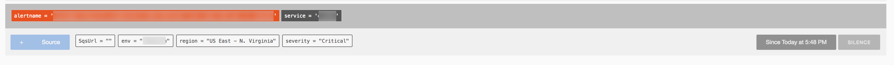

# sqs2alertmanager

sqs2alertmanger receives AWS CloudWatch Alarms from a SQS queue, processes the alarm (json message) and sends it on to prometheus alertmanager which then does
the routing and alerting for the alarm.



## run sqs2alertmanager app

```
go run main.go -url http://localhost:9093 -metrics -r 'alert-(?P<service>\w+)-(?P<appversion>\d+\-\d+\-\d+\-\d+)-(?P<alarmname>.*)$'
```

## help

```
go run main.go -h
```

## install (locally)

```
git config --global url.ssh://git@github.com/.insteadOf https://github.com/
go install github.com/SDFE/sqs2alertmanager
```

## metrics

metric counters are available per instance via

```
curl -s http://127.0.0.1:8888/debug/metrics | jq '.{{ countername_one_of_above }}'
```

or just ..

```
curl -s http://127.0.0.1:8888/debug/metrics | jq '.'
```

### default metrics available

metrix can be given a prefix or take the default (sqs2alertmanager) to identify the service when sending metrics to riemann, by default we collect counters on OK and ERRORS of
- pulling messages from sqs
- sending json/alarm to alertmanager
- deleting messages from sqs

```
"{{prefix}}.alertmanager_err": 0,
"{{prefix}}.alertmanager_ok": 1,
"{{prefix}}.sqs_del_error": 0,
"{{prefix}}.sqs_del_ok": 1,
"{{prefix}}.sqs_rcv_error": 0,
"{{prefix}}.sqs_rcv_ok": 1
```

### per-service alarm counter

additionally, we also count how many alerts of a particular service have been sent to alertmanager

```
"{{prefix}}.alerts.appname": 1,
```

## local / manual testing

### setup dev env

#### run alertmanager in docker

```
cd alertmanager/
docker build . -t local/alertmanager:latest
cd ../
docker run --rm -ti -v "$(pwd)/alertmanager/conf.d:/etc/alertmanager" -p 8080:9093 local/alertmanager
```

#### run go-aws-sqs mock

```
docker run --rm -ti --name go-aws-sqs -p 4100:4100 pafortin/goaws
```

##### create the queue

```
aws --endpoint-url http://localhost:4100 sqs create-queue --queue-name alerts1
```

see: https://github.com/p4tin/GoAws#testing-your-installation

#### riemann (optional)

if you want to send metrics to riemann and want to test stuff locally first, run these two containers

```
docker run --rm -ti -p 5555:5555 -p 5555:5555/udp -p 5556:5556 davidkelley/riemann
docker run --rm -ti -p 4567:4567 davidkelley/riemann-dash
```

then open riemann dashboard on http://localhost:4567/

### run sqs2alertmanager

```
go run main.go -endpoint http://localhost:4100 -url http://localhost:8080 -metrics -r 'alert-(?P<service>\w+)-(?P<appversion>\d+\-\d+\-\d+\-\d+)-(?P<alarmname>.*)$'
```

### send test alerts to the queue
#### put a valid msg on the queue

```
aws --endpoint-url http://localhost:4100 sqs send-message --queue-url http://localhost:4100/alerts1 --message-body '{
  "Type" : "Notification",
  "MessageId" : "11111111-1111-1111-1111-111111111111",
  "TopicArn" : "arn:aws:sns:us-east-1:111111111111:alarms-topic",
  "Subject" : "ALARM: \"alert-appname-0-0-1-0-<ALARM NAME GOES ...\" in US East - N. Virginia",
  "Message" : "{\"AlarmName\":\"alert-appname-0-0-1-0-<ALARM NAME GOES HERE>\",\"AlarmDescription\":\"Alarm description goes here............\",\"AWSAccountId\":\"111111111111\",\"NewStateValue\":\"ALARM\",\"NewStateReason\":\"Threshold Crossed: 1 datapoint (37.1) was less than or equal to the threshold (40.0).\",\"StateChangeTime\":\"2017-04-28T13:05:46.425+0000\",\"Region\":\"US East - N. Virginia\",\"OldStateValue\":\"OK\",\"Trigger\":{\"MetricName\":\"CPUCreditBalance\",\"Namespace\":\"AWS/EC2\",\"StatisticType\":\"Statistic\",\"Statistic\":\"SUM\",\"Unit\":null,\"Dimensions\":[{\"name\":\"AutoScalingGroupName\",\"value\":\"asgname\"}],\"Period\":60,\"EvaluationPeriods\":1,\"ComparisonOperator\":\"LessThanOrEqualToThreshold\",\"Threshold\":40.0,\"TreatMissingData\":\"- TreatMissingData: Ignore\",\"EvaluateLowSampleCountPercentile\":\"\"}}",
  "Timestamp" : "2017-04-28T13:05:46.584Z",
  "SignatureVersion" : "1",
  "Signature" : "X",
  "SigningCertURL" : "https://sns.us-east-1.amazonaws.com/SimpleNotificationService-X.pem",
  "UnsubscribeURL" : "https://sns.us-east-1.amazonaws.com/?Action=Unsubscribe&SubscriptionArn=arn:aws:sns:us-east-1:111111111111:alarms-topic:X"
}'
```

expected output:

```
2017/05/01 17:59:17 info: received  ddf26277-96fe-4d12-95f1-2b8ef901c461
2017/05/01 17:54:28 info: deleted  ddf26277-96fe-4d12-95f1-2b8ef901c461
2017/05/01 17:54:28 ok posting alert to http://localhost:8181, status: 200 OK
```

#### put a invalid msg on the queue

```
aws --endpoint-url http://localhost:4100 sqs send-message --queue-url http://localhost:4100/alerts1 --message-body '{
  "Type" : "Notification",
  "MessageId" : "11111111-1111-1111-1111-111111111111",
  "TopicArn" : "arn:aws:sns:us-east-1:111111111111:alarms-topic",
  "Subject" : "ALARM: \"alert-appname-0-0-1-0-<ALARM DESCRIPTION GOES ...\" in US East - N. Virginia",
  "Message" : "{\"AlarmName\":\"alert-appname-0-0-1-0-<ALARM DESCRIPTION GOES HERE>\",\"AlarmDescription\":\"Alarm description goes here............\",\"AWSAccountId\":\"111111111111\",\"NewStateValue\":\"ALARM\",\"NewStateReason\":\"Threshold Crossed: 1 datapoint (37.1) was less than or equal to the threshold (40.0).\",\"StateChangeTime\":\"2017-04-28T13:05:46.425+0000\",\"Region\":\"US East - N. Virginia\",\"OldStateValue\":\"OK\",\"Trigger\":{\"MetricName\":\"CPUCreditBalance\",\"Namespace\":\"AWS/EC2\",\"StatisticType\":\"Statistic\",\"Statistic\":\"SUM\",\"Unit\":null,\"Dimensions\":[{\"name\":\"AutoScalingGroupName\",\"value\":\"asgname\"}],\"Period\":60,\"EvaluationPeriods\":1,\"ComparisonOperator\":\"LessThanOrEqualToThreshold\",\"Threshold\":40.0,\"TreatMissingData\":\"- TreatMissingData: Ignore\",\"EvaluateLowSampleCountPercentile\":\"\"}}",
  "Timestamp" : "2017-04-28T13:05:46.584Z",
  "SignatureVersion" : "1",
  "Signature" : "X",
  "SigningCertURL" : "https://sns.us-east-1.amazonaws.com/SimpleNotificationService-X.pem",
  "UnsubscribeURL" : "https://sns.us-east-1.amazonaws.com/?Action=Unsubscribe&SubscriptionArn=arn:aws:sns:us-east-1:111111111111:alarms-topic:X"
}'
```

expected output:

```
2017/05/01 17:54:07 error: parsing json:  unexpected end of JSON input
```

#### put a non json message on the queue

```
aws --endpoint-url http://localhost:4100 sqs send-message --queue-url http://localhost:4100/alerts1 --message-body 'hello world'
```

expected output:

```
2017/05/01 17:59:17 info: received  11111111-1111-1111-1111-111111111111
2017/05/01 17:59:17 error: parsing json:  invalid character 'h' looking for beginning of value
```